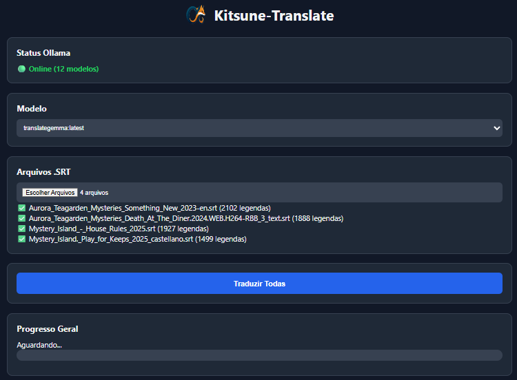
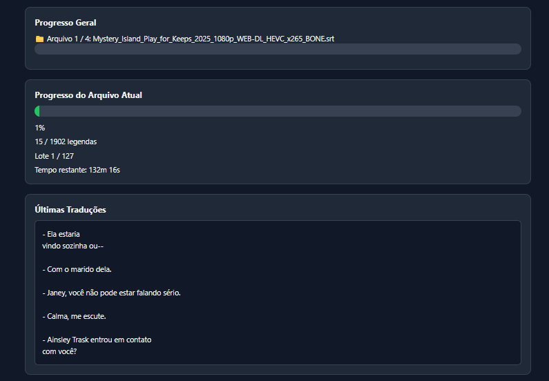
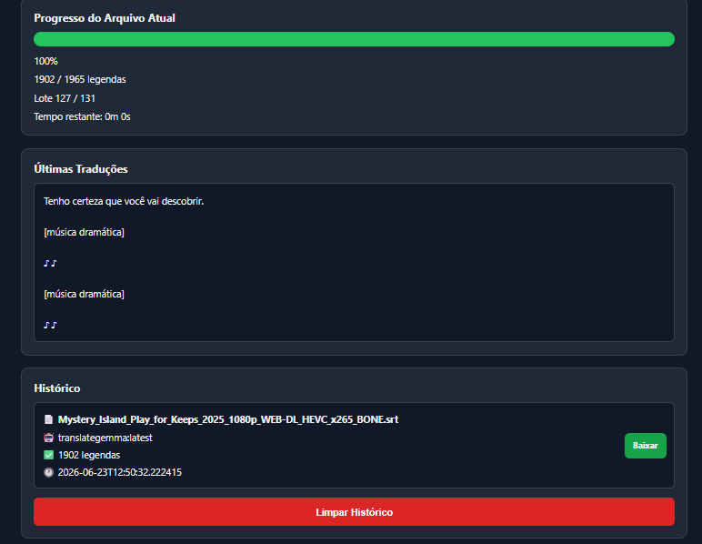

# Kitsune-Translate

<p align="center">
  
</p>

<p align="center">
  <strong>Tradução Inteligente de Legendas com IA Local</strong>
</p>

<p align="center">
  Traduza arquivos SRT utilizando modelos de IA executados localmente através do Ollama.
</p>

<p align="center">
  🔒 Privacidade Total • 🤖 IA Local • ⚡ Tradução em Lote • 🌐 Interface Web
</p>

---

## 📖 Sobre o Projeto

O Kitsune-Translate é uma aplicação web para tradução de legendas que utiliza modelos de linguagem executados localmente através do Ollama.

O sistema preserva toda a estrutura original do arquivo de legenda, incluindo:

- Numeração
- Sincronização (timings)
- Quebras de linha
- Estrutura SRT

Traduzindo apenas o conteúdo textual das falas.

Todo o processamento ocorre localmente, sem necessidade de serviços externos ou envio de dados para terceiros.

---

# ✨ Recursos

- 🤖 Integração com Ollama
- 🔒 Processamento 100% local
- 📂 Tradução de múltiplos arquivos
- 📦 Tradução inteligente em lotes
- 📊 Monitoramento em tempo real
- 👀 Preview das traduções durante o processamento
- 📜 Histórico de traduções
- ⬇️ Download automático dos arquivos traduzidos
- 🌐 Acesso via navegador
- 🖥️ Compatível com Windows e Linux

---

# 📸 Screenshots

## Dashboard

<p align="center">
  
</p>

---

## Tradução em Andamento

<p align="center">
  
</p>

---

## Resultado Final

<p align="center">
  
</p>

---

# 🚀 Como Funciona

```text
Legenda (.srt)
       │
       ▼
 Kitsune-Translate
       │
       ▼
      Ollama
       │
       ▼
Legenda Traduzida
```

O sistema divide automaticamente o conteúdo em lotes para manter contexto durante a tradução e melhorar a qualidade do resultado final.

---

# 🧠 Modelos Recomendados

| Modelo | Qualidade |
|----------|----------|
| translategemma | ⭐⭐⭐⭐⭐ |
| qwen3:8b | ⭐⭐⭐⭐⭐ |
| qwen3:4b | ⭐⭐⭐⭐ |
| gemma3:4b | ⭐⭐⭐⭐ |
| llama3.2:3b | ⭐⭐⭐ |

Qualquer modelo compatível com tradução pode ser utilizado.

---

# 📋 Requisitos

- Python 3.8+
- Ollama instalado
- Pelo menos um modelo baixado
- Navegador moderno

---

# 📦 Instalação

## Instalar Ollama

### Linux

```bash
curl -fsSL https://ollama.com/install.sh | sh
```

### Windows

Baixe em:

https://ollama.com/download

---

## Baixar Modelo

```bash
ollama pull translategemma
```

---

## Executar Aplicação

### Windows

```cmd
executar_windows.bat
```

### Linux

```bash
chmod +x executar_linux.sh
./executar_linux.sh
```

Os scripts realizam automaticamente:

- Criação do ambiente virtual
- Instalação das dependências
- Inicialização do servidor

---

# 🌐 Acesso

Após iniciar:

```text
http://localhost:5000
```

Acesso pela rede local:

```text
http://IP_DO_SERVIDOR:5000
```

---

# 📊 Funcionalidades Detalhadas

| Função | Descrição |
|----------|----------|
| Status Ollama | Verifica disponibilidade do Ollama |
| Seleção de Modelo | Escolha dinâmica dos modelos instalados |
| Tradução em Lotes | Melhor contexto durante a tradução |
| Múltiplos Arquivos | Processamento em fila |
| Preview em Tempo Real | Visualização das últimas traduções |
| Histórico | Armazenamento das traduções realizadas |
| Download | Recuperação rápida dos arquivos gerados |
| Rede Local | Utilização em outros dispositivos |

---

# 📁 Estrutura do Projeto

```text
Kitsune-Translate/
│
├── app.py
├── requirements.txt
├── executar_windows.bat
├── executar_linux.sh
├── auto_iniciar_linux.sh
├── README.md
│
├── screenshots/
│   ├── banner.png
│   ├── dashboard.png
│   ├── translation.png
│   └── result.png
│
├── uploads/
├── translated/
├── temp/
├── database/
│   └── history.db
│
├── logs/
│   └── translator.log
│
├── templates/
│   └── index.html
│
└── static/
    ├── app.js
    └── app.css
```

---

# ⚙️ Inicialização Automática (Linux)

Instale o serviço systemd:

```bash
chmod +x auto_iniciar_linux.sh
./auto_iniciar_linux.sh install
```

Comandos úteis:

```bash
sudo systemctl status tradutor-legendas
sudo systemctl start tradutor-legendas
sudo systemctl stop tradutor-legendas
sudo systemctl restart tradutor-legendas
sudo journalctl -u tradutor-legendas -f
```

---

# 🛣️ Roadmap

- [x] Tradução SRT
- [x] Interface Web
- [x] Integração Ollama
- [x] Histórico de Traduções
- [x] Tradução em Lote
- [ ] ASS / SSA
- [ ] Glossário Personalizado
- [ ] API REST
- [ ] Docker Compose
- [ ] Tradução Paralela

---

# 🔧 Solução de Problemas

### Ollama não encontrado

```bash
ollama list
```

### Instalar modelo

```bash
ollama pull translategemma
```

### Porta ocupada

Altere a porta configurada em:

```python
app.py
```

### Verificar logs

```text
logs/translator.log
```

---

# 📄 Licença

Projeto livre para uso, estudo e modificação.

---

⭐ Se o projeto foi útil para você, considere deixar uma estrela no GitHub.